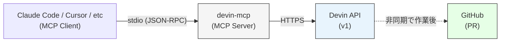
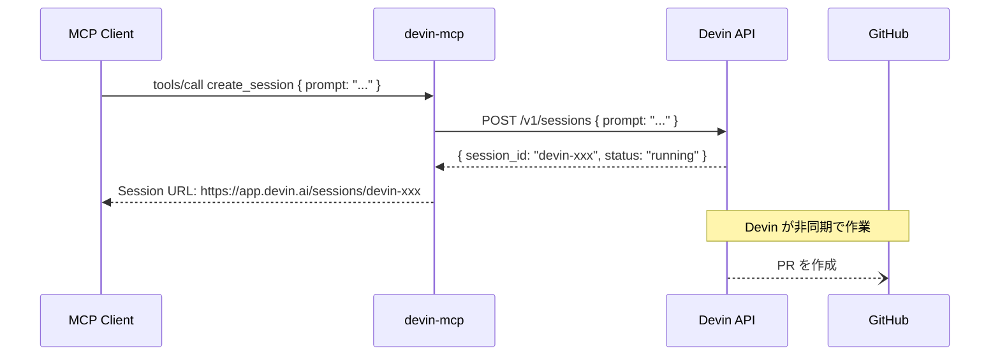

# Architecture

## Overview

## Components

### MCP Server (`src/server.rs`)

4 つのツールを提供する MCP サーバー。

| Tool | Description | Devin API |
|------|-------------|-----------|
| `create_session` | タスクを依頼。URL を返して即完了 | `POST /v1/sessions` |
| `get_session` | セッション状態を確認 | `GET /v1/sessions/{id}` |
| `list_sessions` | セッション一覧を取得 | `GET /v1/sessions` |
| `send_message` | 追加指示を送信 | `POST /v1/sessions/{id}` |

### Devin API Client (`src/devin_client.rs`)

Devin REST API v1 の薄いラッパー。ステートレスで、全メソッドが `&self` を取る。
内部状態は持たず、リクエストごとに完結する。

### Transport

stdio（標準入出力）を使用。MCP クライアントが本バイナリを子プロセスとして起動し、
stdin/stdout で JSON-RPC 2.0 メッセージをやりとりする。

**鉄則: stdout には JSON-RPC のみ。ログは全て stderr へ。**

## Data Flow

### create_session

## Design Decisions

設計上の意思決定は `docs/adr/` に記録する。
